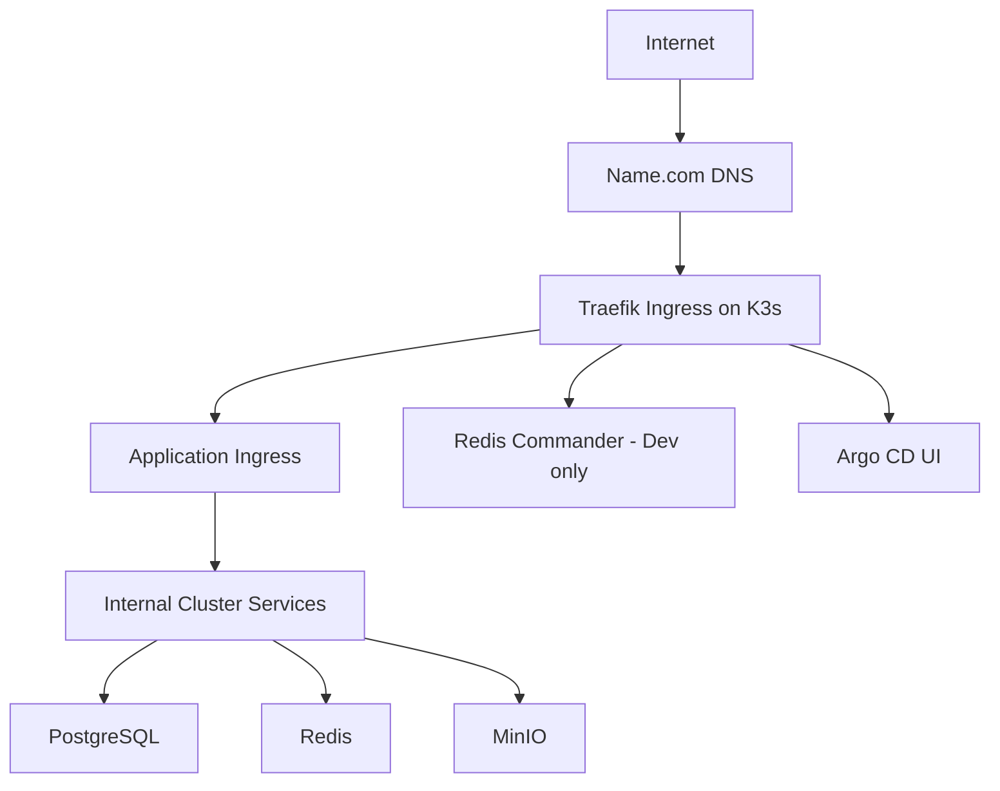
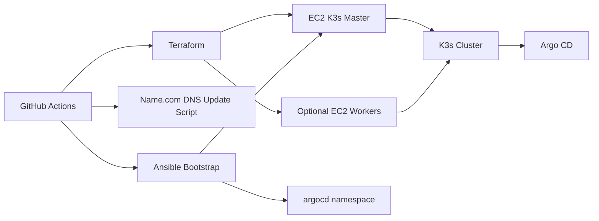
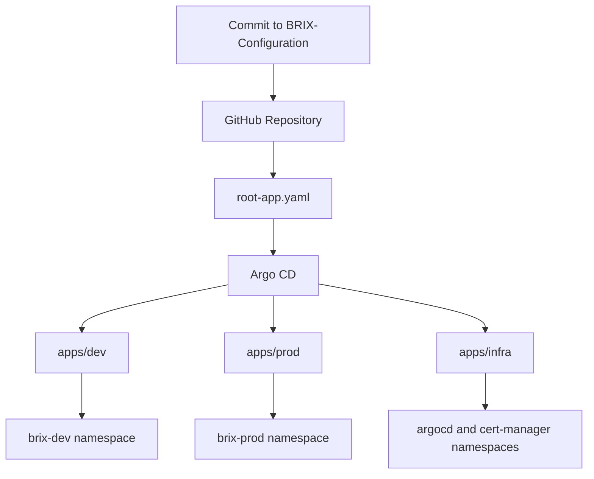

# BRIX Configuration

Infrastructure and GitOps repository for BRIX on AWS with Terraform, Ansible, K3s, Argo CD, Traefik, and cert-manager.

## What This Repo Covers

- AWS infrastructure bootstrap with Terraform
- K3s installation and cluster node join with Ansible
- Argo CD app-of-apps deployment model
- Helm-based application and infrastructure releases
- Dev and prod separation through dedicated namespaces and values files
- TLS termination with Traefik + cert-manager + Let's Encrypt
- Name.com DNS updates during infrastructure creation
- GitHub Actions workflows for infrastructure lifecycle operations

## Stack Snapshot


## Repository Layout

```text
.
|-- .github/workflows/         # Infra automation via GitHub Actions
|-- ansible/                   # K3s, Argo CD, and worker join playbooks
|-- apps/                      # Argo CD Applications and AppProjects
|   |-- dev/
|   |-- prod/
|   `-- infra/
|-- charts/                    # Custom Helm charts
|   |-- fe/
|   |-- be/
|   |-- image-service/
|   `-- redis-commander/
|-- environments/              # Environment-specific Helm values
|   |-- dev/
|   |-- prod/
|   `-- infra/
|-- scripts/                   # Supporting automation scripts
|-- terraform/                 # Master node infrastructure
|   `-- workers/               # Worker node scale-out infrastructure
`-- root-app.yaml              # Argo CD app-of-apps bootstrap
```

## Architecture Overview

Single K3s master on EC2, with optional worker nodes added through a separate workflow.



## Infrastructure Topology

Terraform provisions the EC2 base layer. Ansible then installs K3s on the master node, installs Argo CD, creates namespaces, injects registry credentials, and applies the root Argo application. Additional workers can be created later and joined into the cluster.



## GitOps Deployment Flow

Argo CD watches this repo and syncs manifests into the target namespaces.



## Environment Model

### Namespaces

- `brix-dev`: development workloads
- `brix-prod`: production workloads
- `argocd`: Argo CD control plane
- `cert-manager`: certificate management

### Dev

- Public entry points for dev traffic
- Redis Commander exposed at `https://redis-dev.brix.social`
- Lower resource footprint
- Argo CD is configured with automated sync and self-heal for the main app layer
- PostgreSQL runs in standalone mode
- Redis Commander enabled for debugging

### Prod

- Public entry points for production traffic
- FE, BE, and image-service are configured for manual sync, while stateful services avoid prune
- PostgreSQL runs with replication
- Redis runs with replication
- Horizontal autoscaling enabled for FE and BE
- Redis Commander is not deployed

## Public Endpoints

| Endpoint | Purpose |
| --- | --- |
| `https://brix.social` | Production entry point |
| `https://www.brix.social` | Production alias |
| `https://dev.brix.social` | Development entry point |
| `https://api.brix.social` | Production API entry point |
| `https://api.dev.brix.social` | Development API entry point |
| `https://redis-dev.brix.social` | Redis Commander for dev |
| `https://argocd.brix.social` | Argo CD dashboard |

## Helm and Argo CD Model

- Custom services are deployed from local Helm charts in [`charts/fe`](/F:/BRIX-Configuration/charts/fe), [`charts/be`](/F:/BRIX-Configuration/charts/be), [`charts/image-service`](/F:/BRIX-Configuration/charts/image-service), and [`charts/redis-commander`](/F:/BRIX-Configuration/charts/redis-commander).
- Shared infrastructure services use upstream Helm charts, with local environment overrides from [`environments/dev`](/F:/BRIX-Configuration/environments/dev) and [`environments/prod`](/F:/BRIX-Configuration/environments/prod).
- Argo CD Applications live under [`apps/dev`](/F:/BRIX-Configuration/apps/dev), [`apps/prod`](/F:/BRIX-Configuration/apps/prod), and [`apps/infra`](/F:/BRIX-Configuration/apps/infra).
- [`root-app.yaml`](/F:/BRIX-Configuration/root-app.yaml) bootstraps the full app-of-apps model.

## Traffic, Ingress, and SSL

- Public traffic is routed through Traefik ingress
- TLS is issued by cert-manager through the `letsencrypt-prod` `ClusterIssuer`
- Internal services stay inside the cluster network
- Redis Commander has public ingress only in dev
- Argo CD is exposed through a dedicated Traefik ingress

## Redis Commander

- Runs only in the `brix-dev` namespace
- Connects to `brix-redis-master.brix-dev.svc.cluster.local:6379`
- Exposed publicly at `https://redis-dev.brix.social`

## Database, Cache, and Object Storage

### PostgreSQL

- Dev uses standalone PostgreSQL
- Prod uses replication with one primary and one read replica
- Persistent volumes use the K3s `local-path` storage class

### Redis

- Dev uses standalone Redis
- Prod uses replication with one master and one replica
- Metrics are enabled in prod

### MinIO

- Internal object storage for BRIX services
- `ClusterIP` only, not publicly exposed

## GitHub Actions Workflows

### Available Workflows

- `infra-create.yml`
  - runs Terraform for the master node
  - reads the new public IP from Terraform output
  - updates Name.com DNS A records
  - renders Ansible inventory dynamically
  - installs K3s and Argo CD
  - bootstraps the root Argo application

- `infra-add-worker.yml`
  - provisions one or more extra EC2 worker nodes
  - generates worker inventory
  - joins workers to the K3s cluster with Ansible

- `infra-remove-worker.yml`
  - drains the last worker from K3s
  - deletes the node from the cluster
  - updates Terraform state to remove that EC2 worker

- `infra-stop.yml`
  - stops running BRIX EC2 instances by tag

- `infra-destroy.yml`
  - destroys worker nodes first
  - then destroys the master and related infrastructure

## Name.com DNS Automation

The script [`scripts/update_dns.py`](/F:/BRIX-Configuration/scripts/update_dns.py) updates Name.com A records for:

- root domain `brix.social`
- `dev.brix.social`
- `api.brix.social`
- `www.brix.social`
- `redis-dev.brix.social`
- `argocd.brix.social`
- `api.dev.brix.social`

## Terraform Scope

Terraform is split into two layers:

- [`terraform/`](/F:/BRIX-Configuration/terraform): provisions the main EC2 instance, public IP attachment, root disk, and security group
- [`terraform/workers/`](/F:/BRIX-Configuration/terraform/workers): provisions optional worker nodes and reuses the master subnet and security group

Remote state is stored in S3 with DynamoDB locking.

## Ansible Scope

Ansible handles cluster bootstrap and worker join operations.

- [`ansible/setup-k3s.yml`](/F:/BRIX-Configuration/ansible/setup-k3s.yml) installs K3s, creates namespaces, installs Argo CD, injects repo credentials, and applies the root application and Argo ingress
- [`ansible/join-worker.yml`](/F:/BRIX-Configuration/ansible/join-worker.yml) reads the K3s node token from the master and joins worker nodes as agents

## Local Bootstrap

If the cluster already exists and you just want Argo CD to take over:

```bash
kubectl apply -f root-app.yaml
```

If Argo CD is not installed yet:

```bash
kubectl create namespace argocd
kubectl apply -n argocd -f https://raw.githubusercontent.com/argoproj/argo-cd/stable/manifests/install.yaml
kubectl apply -f root-app.yaml
```

## Summary

Terraform provisions AWS, Ansible bootstraps K3s, and Argo CD applies GitOps-based deployments for dev and prod.
